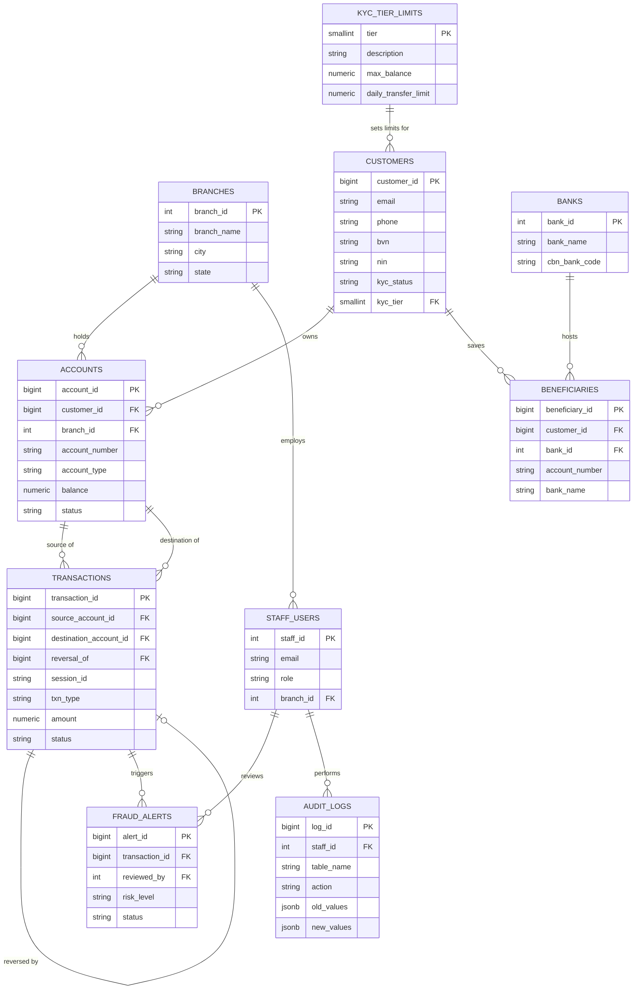

# SaviourPay ER Diagram

```mermaid
erDiagram
    BRANCHES ||--o{ ACCOUNTS : holds
    BRANCHES ||--o{ STAFF_USERS : employs
    CUSTOMERS ||--o{ ACCOUNTS : owns
    CUSTOMERS ||--o{ BENEFICIARIES : saves
    KYC_TIER_LIMITS ||--o{ CUSTOMERS : "sets limits for"
    BANKS ||--o{ BENEFICIARIES : hosts
    ACCOUNTS ||--o{ TRANSACTIONS : "source of"
    ACCOUNTS ||--o{ TRANSACTIONS : "destination of"
    TRANSACTIONS ||--o| TRANSACTIONS : "reversed by"
    TRANSACTIONS ||--o{ FRAUD_ALERTS : triggers
    STAFF_USERS ||--o{ FRAUD_ALERTS : reviews
    STAFF_USERS ||--o{ AUDIT_LOGS : performs

    BRANCHES {
        int branch_id PK
        string branch_name
        string city
        string state
    }
    CUSTOMERS {
        bigint customer_id PK
        string email
        string phone
        string bvn
        string nin
        string kyc_status
        smallint kyc_tier FK
    }
    KYC_TIER_LIMITS {
        smallint tier PK
        string description
        numeric max_balance
        numeric daily_transfer_limit
    }
    BANKS {
        int bank_id PK
        string bank_name
        string cbn_bank_code
    }
    STAFF_USERS {
        int staff_id PK
        string email
        string role
        int branch_id FK
    }
    ACCOUNTS {
        bigint account_id PK
        bigint customer_id FK
        int branch_id FK
        string account_number
        string account_type
        numeric balance
        string status
    }
    BENEFICIARIES {
        bigint beneficiary_id PK
        bigint customer_id FK
        int bank_id FK
        string account_number
        string bank_name
    }
    TRANSACTIONS {
        bigint transaction_id PK
        bigint source_account_id FK
        bigint destination_account_id FK
        bigint reversal_of FK
        string session_id
        string txn_type
        numeric amount
        string status
    }
    FRAUD_ALERTS {
        bigint alert_id PK
        bigint transaction_id FK
        int reviewed_by FK
        string risk_level
        string status
    }
    AUDIT_LOGS {
        bigint log_id PK
        int staff_id FK
        string table_name
        string action
        jsonb old_values
        jsonb new_values
    }
```
